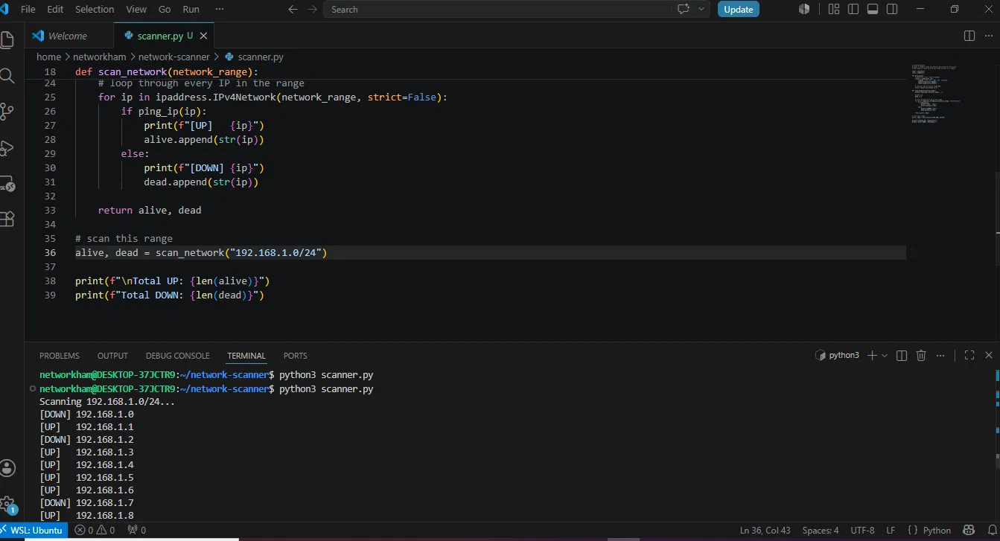

# network-scanner

A Python tool that scans a network range and detects which devices are alive.
Built as part of my network automation learning path.

## What it does

- Takes a network range like 192.168.1.0/24
- Pings every IP in the range automatically
- Shows which devices are UP or DOWN
- Saves results to a report file

## Why /24

/24 means the subnet mask is 255.255.255.0 — it gives us 254 usable IP addresses
from 192.168.1.1 to 192.168.1.254. Most home and small office networks use /24
because it's the right size — enough IPs for all devices without wasting address space.
Scanning the full /24 means we check every possible device on that network.

## Demo

## How to run

python3 scanner.py

## Tools used

- Python 3.12
- subprocess — to run ping commands
- ipaddress — to calculate IP ranges
- Ubuntu WSL

## Author

Mohammed Hammouch — Casablanca, Morocco